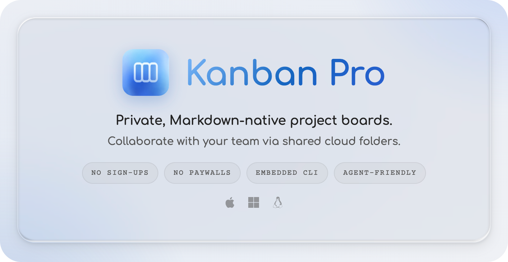

  

https://github.com/user-attachments/assets/cd87432b-c064-43b5-a03c-c2dbdc94284f

# Kanban Pro

A local-first, filesystem-backed Kanban board. Your boards live as Markdown files on disk — fully portable, AI-agent readable, no vendor lock-in.

   

## Download — Early Access

| Platform | Download |
|----------|----------|
| **Apple Silicon** (M1 / M2 / M3 / M4 / M5) | [Kanban Pro — arm64.dmg](https://github.com/donkruger/Kanban/releases/latest) |
| **Intel Mac** | [Kanban Pro — x64.dmg](https://github.com/donkruger/Kanban/releases/latest) |
| **Windows** (x64) | [Kanban Pro Setup.exe](https://github.com/donkruger/Kanban/releases/latest) |
| **Linux** (x64) | [Kanban Pro — AppImage](https://github.com/donkruger/Kanban/releases/latest) |

macOS DMGs are **signed and notarized** with Apple Developer ID. The Windows installer is currently unsigned pending an EV code-signing certificate; Windows SmartScreen may display a warning on first launch — click "More info" → "Run anyway". Linux ships as an **AppImage** (x64); make it executable (`chmod +x`) then run it.

## Website

[goodguyapps.com](https://goodguyapps.com)

## Privacy Policy

[goodguyapps.com/privacy](https://goodguyapps.com/privacy)

## License

Kanban Pro is proprietary software. All rights reserved.
